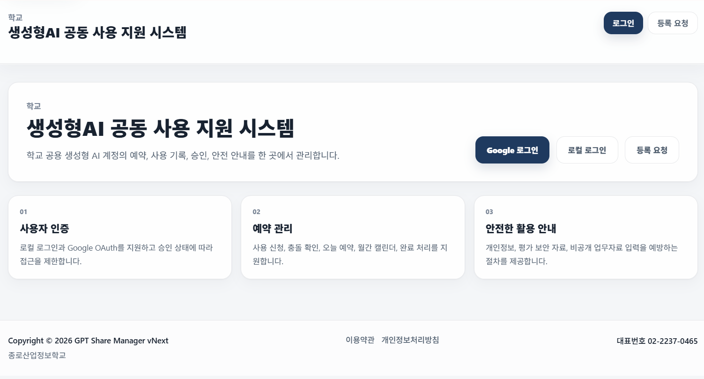
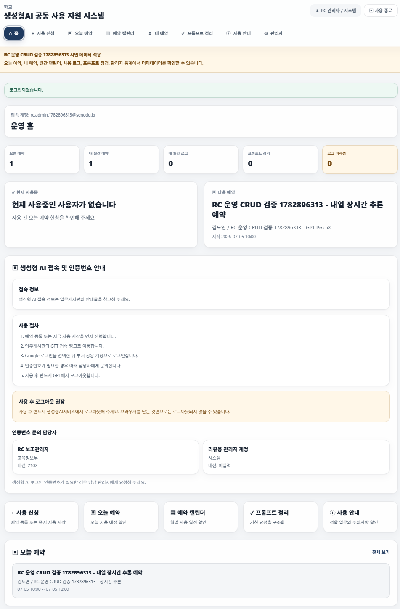
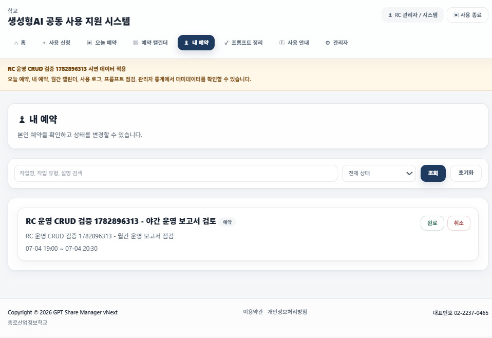
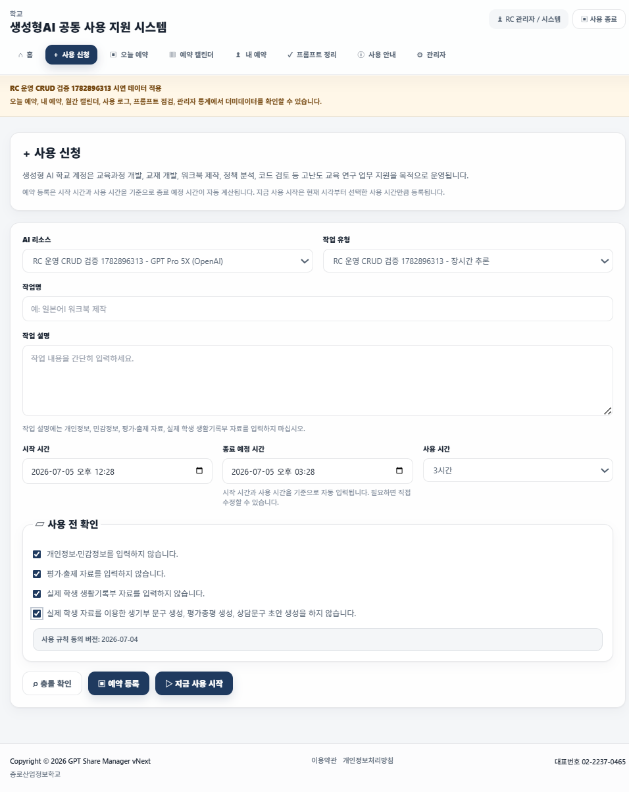
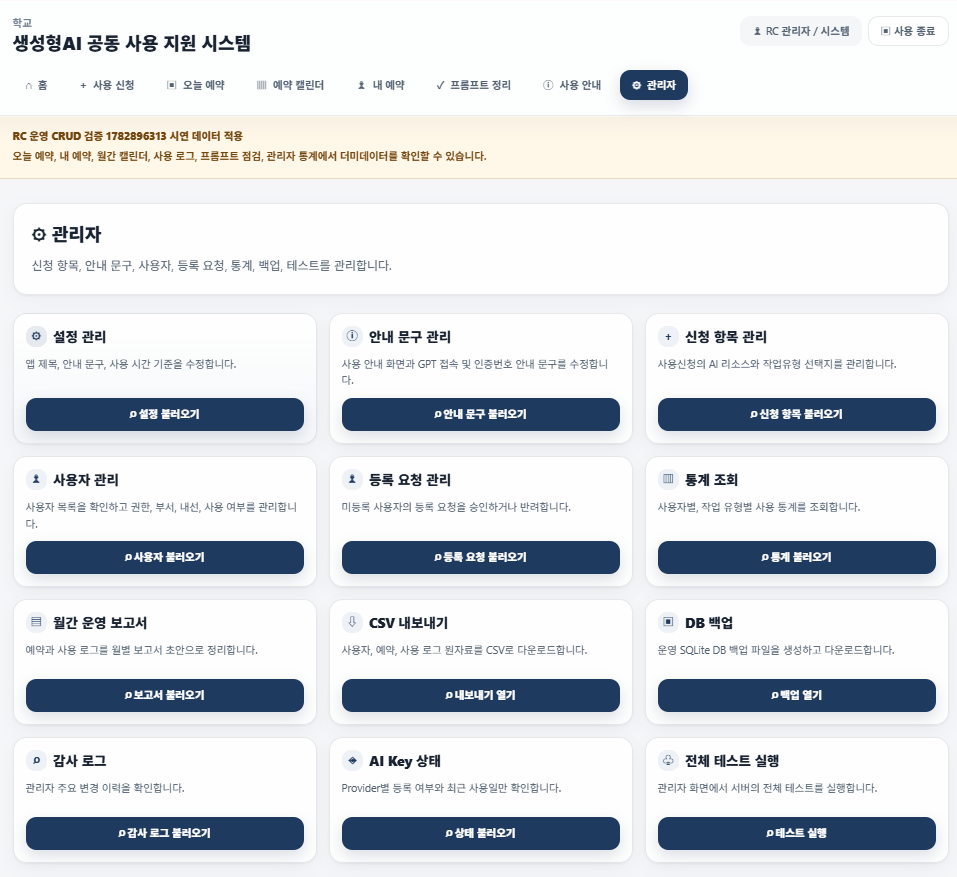
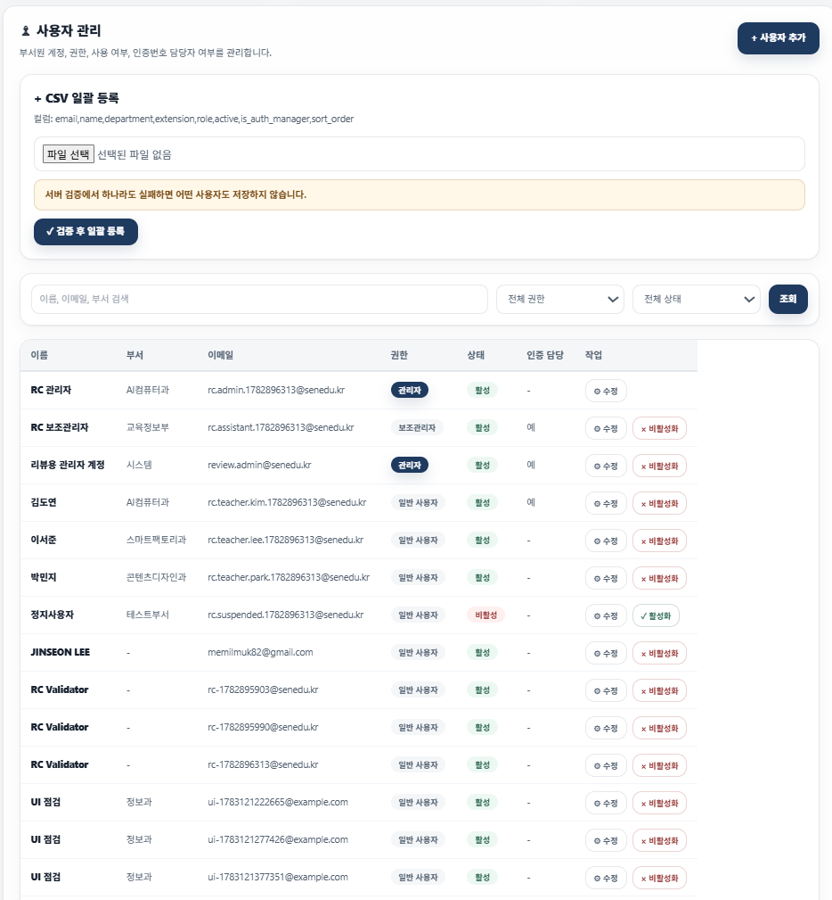
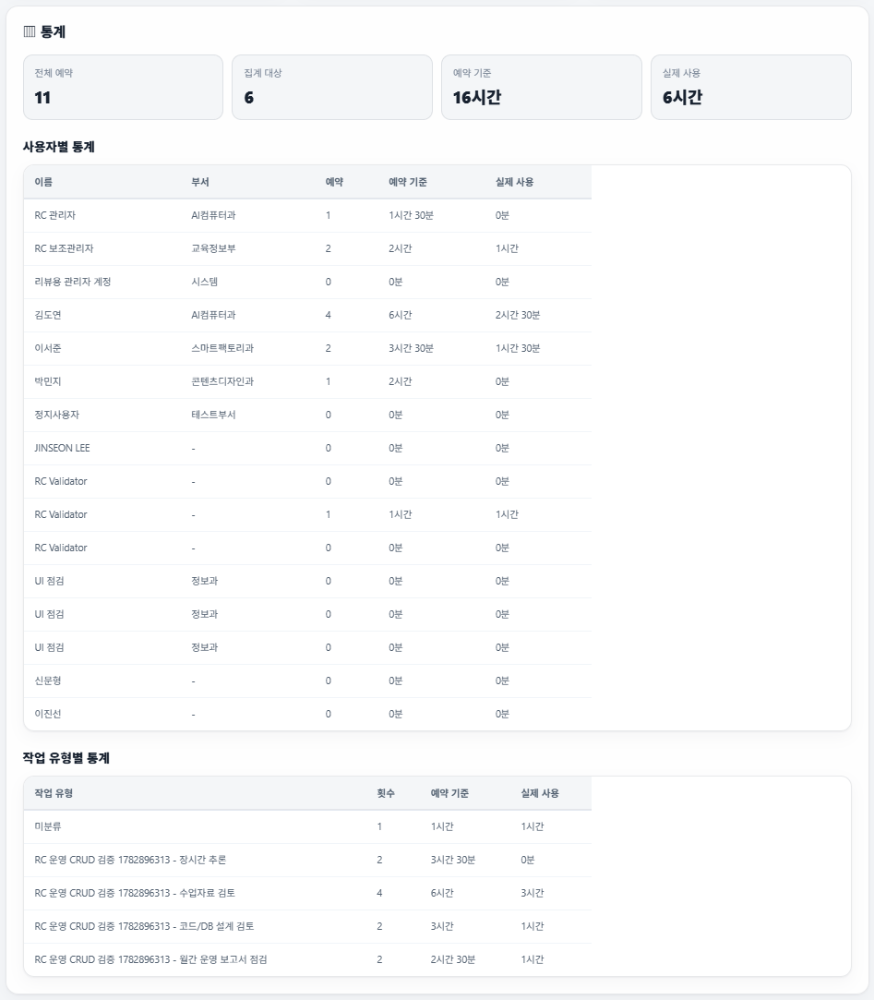
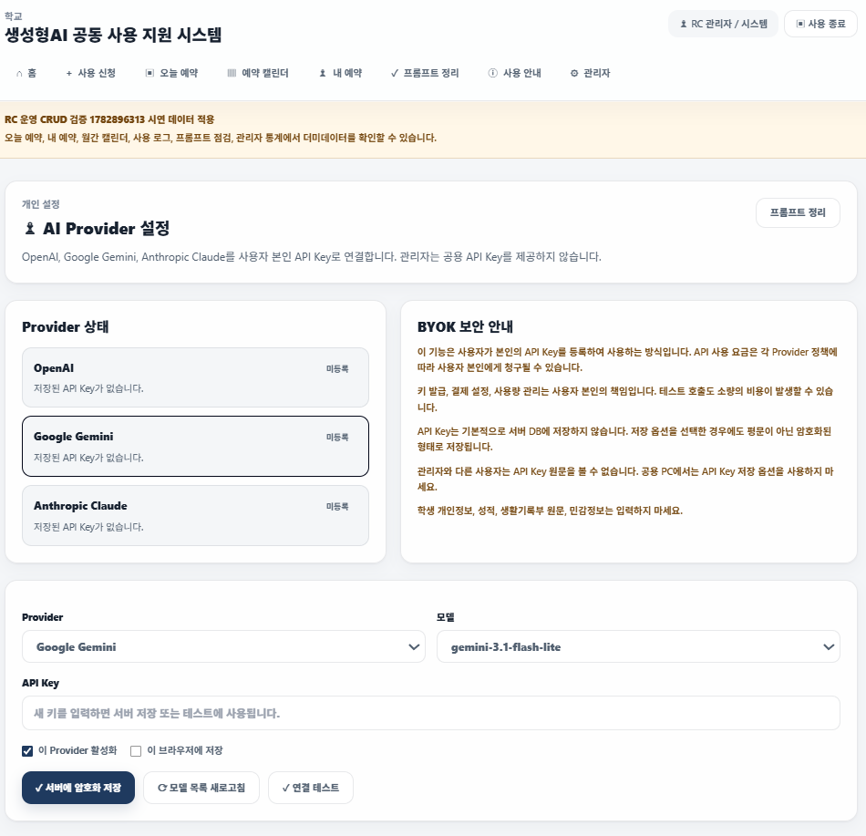

# 🏫 생성형 AI 계정 공동 사용 지원 시스템

## 🌐  접속 주소

 [https://dev-gpt.memilmuk82.com](https://dev-gpt.memilmuk82.com)에서 확인할 수 있습니다.

## 🔐 리뷰용 테스트 계정

리뷰용 관리자 계정은 기본으로 자동 생성되지 않습니다. 제출 시연이나 외부 리뷰에 임시 관리자 계정이 필요할 때만 `.env`에 아래 값을 명시합니다.

```text
역할: 관리자
이메일: review.admin@senedu.kr
임시 비밀번호: ReviewAdmin!2026
```

```text
ENABLE_REVIEW_ADMIN=true
REVIEW_ADMIN_EMAIL=review.admin@senedu.kr
REVIEW_ADMIN_PASSWORD=ReviewAdmin!2026
```

이 계정은 Google OAuth 계정이 아닙니다. 로그인 화면의 Google 로그인 버튼이 아니라 이메일과 비밀번호 입력 폼에 위 이메일과 임시 비밀번호를 직접 입력해야 로그인됩니다. 운영 전에는 `ENABLE_REVIEW_ADMIN=false`로 두거나 관리자 화면에서 해당 계정을 비활성화하세요. 실제 운영 비밀번호로 재사용하지 않습니다.

## 🧪 시연용 더미데이터 계정

`RC 운영 CRUD 검증 1782896313` 더미데이터를 주입하면 아래 로컬 계정으로 각 메뉴를 확인할 수 있습니다. 모든 계정의 시연용 비밀번호는 `DemoUser!2026`입니다.

| 역할 | 이메일 | 확인 용도 |
| --- | --- | --- |
| 관리자 | `rc.admin.1782896313@senedu.kr` | 관리자 대시보드, 사용자 관리, 보고서, 감사 로그, CSV/백업 |
| 보조관리자 | `rc.assistant.1782896313@senedu.kr` | 보조관리자 권한과 인증번호 담당자 표시 |
| 일반 사용자 | `rc.teacher.kim.1782896313@senedu.kr` | 내 예약, 오늘 예약, 완료/취소/예정, 미작성 로그 알림 |
| 일반 사용자 | `rc.teacher.lee.1782896313@senedu.kr` | 완료 예약, 사용 로그, 프롬프트 정리 기록 |
| 일반 사용자 | `rc.teacher.park.1782896313@senedu.kr` | 오늘 예약, 취소 예약, 캘린더 표시 |
| 정지 사용자 | `rc.suspended.1782896313@senedu.kr` | 정지 계정 로그인 차단 확인 |

이 계정과 데이터는 시연·리뷰용입니다. 운영 전에는 DB 백업을 복원하거나 `uv run python scripts/seed_demo_data.py --clear-only`로 같은 태그의 더미데이터를 제거한 뒤 운영 계정만 유지하세요.

## 🧭 프로젝트 소개

이 프로젝트는 종로산업정보학교 AI컴퓨터과 교육과정에서 사용하는 실제 프로젝트입니다. 단순한 예제 코드가 아니라 학교 현장에서 공용 생성형 AI 계정을 사용할 때 생기는 예약, 승인, 충돌, 기록, 관리 문제를 해결하기 위해 제작되었습니다.

주요 구현 범위는 다음과 같습니다.

```text
공용 생성형 AI 계정 예약
사용자 승인과 권한 관리
예약 충돌 방지
사용 로그 관리
BYOK 기반 AI 프롬프트 정리
관리자 대시보드
CSV 내보내기와 SQLite 백업 등 운영 편의 기능
Docker Compose 기반 배포
```

이 저장소는 교육용 예제이면서 동시에 실제 운영 가능한 수준을 목표로 합니다. 학생들은 이 프로젝트를 통해 Flask 기반 웹 애플리케이션이 어떤 구조로 만들어지고, 학교 업무 문제를 코드로 어떻게 해결하는지 확인할 수 있습니다.

개발 배경은 학생들이 3월부터 배운 Python, Flask, SQLite 기반 웹 개발 흐름을 실제 학교 문제에 적용하고, 2학기 개인 프로젝트에서 SQLAlchemy, Docker, OCI 배포까지 확장할 수 있는 기준 사례를 제공하는 데 있습니다. 그래서 기술 선택도 복잡한 관리형 서비스보다 수업에서 설명 가능한 Flask, SQLite/SQLAlchemy, Docker Compose, OCI 흐름을 중심으로 구성했습니다.

## 🤖 개발 도구와 생성형 AI 활용

이 프로젝트는 OpenAI Codex와 ChatGPT를 개발 보조 도구로 활용하여 제작했습니다. Codex와 ChatGPT는 요구사항 정리, 코드 작성 보조, 코드 리뷰, 디버깅, 리팩터링, 테스트 점검, 문서 작성 과정에서 협업 도구로 사용되었습니다.

다만 생성형 AI가 프로젝트의 목적과 구조를 대신 결정한 것은 아닙니다. 학교 현장에서 필요한 문제를 기준으로 요구사항을 정리하고, 실제 코드와 동작을 검토하며, 교육과정에서 설명 가능한 수준으로 유지하는 것을 원칙으로 개발했습니다.

## 🗺️ 처음 보는 분이라면

프로젝트 전체를 빠르게 이해하려면 아래 순서로 읽는 것을 권장합니다.

1. 🧭 `README.md`: 프로젝트 목적, 실행 방법, 문서 포털
2. 🎓 `docs/EDUCATION.md`: 교육 철학과 기술 선정 이유
3. ✅ `PROJECT_STATUS.md`: 현재 구현 상태와 검증 결과
4. 🏗️ `SYSTEM_DESIGN.md`: 데이터 모델, 라우트, 서비스 구조
5. 🗂️ `docs/architecture/REPOSITORY_STRUCTURE.md`: 디렉터리 구조
6. 📝 `docs/development/DEVELOPMENT_LOG.md`: 개발 과정과 변경 이력
7. 🚀 `docs/deployment/OCI_DEV_SERVER_SETUP.md`: 배포와 서버 운영
8. 💻 `app/`, `tests/`: 실제 코드와 테스트

## 📚 프로젝트 문서 안내

README는 프로젝트의 입구 역할을 합니다. 현재 상태는 PROJECT_STATUS, 구조는 SYSTEM_DESIGN, UI 기준은 docs/ui 문서, 교육 철학은 EDUCATION, 배포 절차는 deployment 문서, 변경 이력은 development 문서에서 확인합니다.

| 문서 | 언제 읽는가 | 담고 있는 내용 |
| --- | --- | --- |
| [docs/EDUCATION.md](docs/EDUCATION.md) | 교육과정과 기술 선정 이유를 이해할 때 | 교육 목표, 교육 철학, 생성형 AI 활용 원칙, 월별 교육 흐름 |
| [PROJECT_STATUS.md](PROJECT_STATUS.md) | 현재 구현 상태를 확인할 때 | 완료 기능, 권한 정책, 검증 결과, 남은 작업 |
| [SYSTEM_DESIGN.md](SYSTEM_DESIGN.md) | 코드 구조를 이해하기 전 | 전체 구조, 기술 스택, 데이터 모델, 라우트 설계 |
| [docs/architecture/REPOSITORY_STRUCTURE.md](docs/architecture/REPOSITORY_STRUCTURE.md) | 파일 위치를 찾을 때 | 저장소 디렉터리 구조와 구조화 원칙 |
| [PROJECT_INSTRUCTIONS.md](PROJECT_INSTRUCTIONS.md) | Codex 또는 협업 개발 규칙을 확인할 때 | 개발 원칙, 금지 사항, 작업 전 보고 기준 |
| [CODEX_START_HERE.md](CODEX_START_HERE.md) | Codex 작업을 시작할 때 | Codex가 먼저 읽을 문서 순서와 작업 금지 사항 |
| [MANIFEST.md](MANIFEST.md) | 문서 패킷 구성을 확인할 때 | 프로젝트 주요 문서 목록과 패킷 구성 |
| [TASK.md](TASK.md) | 최근 Codex 작업 메모를 볼 때 | 현재 작업 상태, 최근 검증 기준, 운영 TODO |
| [PRD.md](PRD.md) | 초기 요구사항 기준을 볼 때 | 배경, 목적, 핵심 사용자, 기능 요구사항. 현재 상태는 PROJECT_STATUS를 우선합니다. |
| [DEVELOPMENT_PLAN.md](DEVELOPMENT_PLAN.md) | 초기 일정과 Phase 계획을 볼 때 | 개발 전략과 날짜별 계획 기록. 현재 완료 상태는 PROJECT_STATUS를 우선합니다. |
| [docs/development/DEVELOPMENT_LOG.md](docs/development/DEVELOPMENT_LOG.md) | 구현 과정을 추적할 때 | 단계별 구현 내용, 결정 이유, 검증 기록 |
| [docs/development/TEST_REPORT.md](docs/development/TEST_REPORT.md) | 테스트 이력을 볼 때 | 테스트 원칙, 단계별 테스트 결과 |
| [docs/development/RELEASE_CHECKLIST.md](docs/development/RELEASE_CHECKLIST.md) | 배포/제출 전 점검할 때 | 현재 릴리스 기준, 완료 조건, 최종 테스트 시나리오 |
| [docs/ui/UI_GUIDE.md](docs/ui/UI_GUIDE.md) | 화면별 UI 기준을 볼 때 | Landing, Auth, Dashboard, Prompt, Admin 등 화면별 UI/UX 규칙 |
| [docs/ui/DESIGN_SYSTEM.md](docs/ui/DESIGN_SYSTEM.md) | 공통 UI 토큰과 컴포넌트를 볼 때 | color, type, spacing, radius, badge, table, form, accessibility 기준 |
| [docs/ui/DESIGN_DECISIONS.md](docs/ui/DESIGN_DECISIONS.md) | 디자인 선택 이유를 볼 때 | Apple/Vercel/GitHub/Linear 등 참고 범위와 제외 기준 |
| [docs/guides/CODEX_PHASE_1_PROMPT.md](docs/guides/CODEX_PHASE_1_PROMPT.md) | 초기 Codex 프롬프트를 참고할 때 | Phase 1 작업 지시문 기록 |
| [docs/guides/BYOK_AI_USAGE_GUIDE.md](docs/guides/BYOK_AI_USAGE_GUIDE.md) | BYOK AI 사용 안내를 볼 때 | Provider 설정, 저장 방식, 비용 책임, 외부 전송, 입력 금지 항목 |
| [docs/deployment/OCI_DEV_SERVER_SETUP.md](docs/deployment/OCI_DEV_SERVER_SETUP.md) | 서버 구축과 배포를 진행할 때 | OCI, Docker, Nginx, HTTPS 구성 절차 |
| [docs/deployment/GOOGLE_OAUTH_REDIRECT_URI.md](docs/deployment/GOOGLE_OAUTH_REDIRECT_URI.md) | Google OAuth를 설정할 때 | Redirect URI, 승인 정책, 점검 방법 |
| [docs/decisions/TECH_STACK_DECISIONS.md](docs/decisions/TECH_STACK_DECISIONS.md) | 기술 선택 배경을 볼 때 | Flask, SQLite, Tailwind, Docker, OCI 선택 이유 |
| [docs/decisions/SECURITY_DECISIONS.md](docs/decisions/SECURITY_DECISIONS.md) | 보안 제외 범위와 원칙을 볼 때 | 공용 계정 정보 미저장, 개인정보 입력 제한, API Key 암호화 |
| [docs/adr/0001-use-flask-sqlite-docker-oci.md](docs/adr/0001-use-flask-sqlite-docker-oci.md) | 주요 아키텍처 결정을 볼 때 | Flask + SQLite + Docker Compose + OCI 결정 |
| [docs/adr/0002-use-gemini-for-prompt-review.md](docs/adr/0002-use-gemini-for-prompt-review.md) | 초기 Gemini 단일 Provider 결정을 볼 때 | 현재는 ADR 0004 BYOK 구조로 대체됨 |
| [docs/adr/0003-release-freeze.md](docs/adr/0003-release-freeze.md) | 릴리스 동결 기준을 볼 때 | RC와 Release Freeze 원칙 |
| [docs/adr/0004-byok-llm-provider-settings.md](docs/adr/0004-byok-llm-provider-settings.md) | BYOK AI 설정 결정을 볼 때 | OpenAI/Gemini/Claude 사용자별 키 구조와 보안 원칙 |
| [docs/legal/TERMS.md](docs/legal/TERMS.md) | 이용 조건을 확인할 때 | 이용약관 원문 |
| [docs/legal/PRIVACY_POLICY.md](docs/legal/PRIVACY_POLICY.md) | 개인정보 처리 기준을 확인할 때 | 개인정보처리방침 원문 |
| [docs/legal/LEGAL_REVIEW_CHECKLIST.md](docs/legal/LEGAL_REVIEW_CHECKLIST.md) | 운영 전 법률 검토를 준비할 때 | 약관/개인정보처리방침 검토 항목 |

개발 변경 기록 문서:

| 문서 | 역할 |
| --- | --- |
| [docs/development/2026-07-03_ADMIN_RESERVATION_UI_UPDATE.md](docs/development/2026-07-03_ADMIN_RESERVATION_UI_UPDATE.md) | 관리자, 예약, 안내 UI와 수업 맥락 반영 기록 |
| [docs/development/2026-07-03_SECURITY_OPERATION_HARDENING.md](docs/development/2026-07-03_SECURITY_OPERATION_HARDENING.md) | 운영 보안과 사용 흐름 보완 기록 |
| [docs/development/2026-07-03_REMAINING_FEATURES_COMPLETION.md](docs/development/2026-07-03_REMAINING_FEATURES_COMPLETION.md) | 잔여 기능 보완 기록 |
| [docs/development/2026-07-04_FULL_OPERATIONAL_FEATURES.md](docs/development/2026-07-04_FULL_OPERATIONAL_FEATURES.md) | 전체 운영 편의 기능 보완 기록 |
| [docs/development/2026-07-04_UI_SYSTEM_REFRESH.md](docs/development/2026-07-04_UI_SYSTEM_REFRESH.md) | UI 디자인 시스템 개선 기록 |
| [docs/development/2026-07-05_UX_OPERATIONAL_FINISHING.md](docs/development/2026-07-05_UX_OPERATIONAL_FINISHING.md) | 예약 UX, 모바일 내비게이션, CSV 필터, 백업 보관 정책 마감 보완 기록 |
| [docs/development/2026-07-05_UI_DESIGN_SYSTEM_IMPLEMENTATION.md](docs/development/2026-07-05_UI_DESIGN_SYSTEM_IMPLEMENTATION.md) | UI 디자인 시스템 실제 코드 적용 기록 |

운영 방식은 README에서 출발해 `PROJECT_STATUS.md`, `SYSTEM_DESIGN.md`, `docs/ui` 문서, `docs/EDUCATION.md`, 배포 문서, 실제 코드 순서로 연결되도록 구성했습니다. 초기 요구사항과 일정 문서는 기록으로 보존하되 현재 상태 판단에는 PROJECT_STATUS를 우선합니다.

## 🎓 종로산업정보학교 AI컴퓨터과 교육과정

이 프로젝트는 종로산업정보학교 AI컴퓨터과의 1년 교육 흐름과 연결되어 있습니다. 학생들이 Python 문법에서 시작해 웹 개발, 데이터베이스, ORM, Docker, Cloud, Infrastructure, 개인 프로젝트까지 자연스럽게 이어가도록 설계된 과정입니다.

상세한 교육 철학, 기술 선정 이유, 생성형 AI 활용 원칙은 [docs/EDUCATION.md](docs/EDUCATION.md)를 참고하세요.

| 시기 | 학습 내용 | 다음 단계로 이어지는 이유 |
| --- | --- | --- |
| 3월 | WSL2 Ubuntu, Python 기초, Flask, Jinja2, HTML, Tailwind CSS, GitHub | 개발 환경과 웹 요청/응답의 기본 흐름을 직접 경험합니다. |
| 4월 | Flask CRUD, 리스트 기반 데이터 처리, HTTP 요청/응답 | 화면과 서버가 데이터를 주고받는 구조를 익힙니다. |
| 5월 | Flask CRUD, 딕셔너리, 리스트 안의 딕셔너리 | 여러 데이터를 구조화해 다루는 방식을 배웁니다. |
| 6월 | ID 기반 CRUD, SQLite, 데이터베이스 기초 | 파일/메모리 데이터에서 실제 DB 저장 구조로 넘어갑니다. |
| 7월 | SQLAlchemy ORM, Flask + ORM 구조 | Python 코드와 DB 테이블을 연결하는 방식을 익힙니다. |
| 8월 | SQLAlchemy ORM, PostgreSQL, 개인 프로젝트 기획, Kanban Board | 개인 프로젝트를 계획하고 운영 가능한 DB로 확장합니다. |
| 9월 | PostgreSQL, Docker, GitHub CLI, 개인 프로젝트 진행 | 개발 환경과 실행 환경을 분리하고 배포 준비를 시작합니다. |
| 10월 | Oracle Cloud Infrastructure, Linux 서버, Nginx, Infrastructure 구축 | 만든 서비스를 실제 서버에서 운영하는 과정을 경험합니다. |
| 11~12월 | FastAPI CRUD, 개인 프로젝트 완성 | Flask로 익힌 구조를 다른 백엔드 방식으로 확장해 봅니다. |

## 🧑‍🏫 교육 과정 운영 원칙

가장 중요한 원칙은 다음과 같습니다.

```text
학생이 이해하지 못하는 코드나 기술을 사용하지 않는다.
```

본 교육과정은 생성형 AI를 적극 활용하지만, 기초 문법과 웹 개발 흐름을 이해하기 전까지는 AI가 코드를 대신 작성하는 방식으로 수업을 진행하지 않습니다. 학생이 직접 코드를 작성하며 웹 애플리케이션의 동작 원리를 이해하는 것을 우선합니다.

개인 프로젝트 단계인 8월 이후부터는 생성형 AI를 개발 파트너로 활용합니다. 이때 AI는 개발자를 대체하는 도구가 아니라 생산성을 높이는 협업 도구로 사용합니다.

```text
요구사항 작성
코드 리뷰
디버깅
리팩토링
테스트
문서 작성
```

프론트엔드는 HTML, CSS, Vanilla JavaScript, Tailwind CSS로 제한합니다. React, Vue, Svelte, Angular 같은 SPA 프레임워크는 좋은 도구이지만, JavaScript와 비동기 처리, 모듈 시스템, 번들러, 컴포넌트 구조, TypeScript에 대한 이해가 충분해진 뒤 학습하는 편이 교육 효과가 높다고 판단했습니다.

백엔드는 Flask를 중심으로 학습합니다. Flask는 HTTP 요청, 라우팅, 템플릿, CRUD, DB, ORM, 인증, 배포 흐름을 비교적 적은 코드로 이해하기에 적합합니다. Django, Django REST Framework, FastAPI도 우수한 프레임워크이지만, 교육 기간과 학생 수준, 프로젝트 규모를 고려해 이 과정에서는 Flask를 중심으로 운영합니다.

## 🧩 기술 선택 이유

README에서는 기술 선택의 핵심 방향만 요약합니다. 상세한 교육적 이유는 [docs/EDUCATION.md](docs/EDUCATION.md), 아키텍처 결정은 [docs/decisions/TECH_STACK_DECISIONS.md](docs/decisions/TECH_STACK_DECISIONS.md)에서 확인합니다.

| 영역 | 선택 | 이유 |
| --- | --- | --- |
| 🧠 언어 | Python | 학생이 문법과 서버 로직을 한 흐름으로 설명하기 쉽습니다. |
| 🌐 백엔드 | Flask | HTTP, 라우팅, 템플릿, CRUD 구조가 직접 드러납니다. |
| 🗄️ 데이터 | SQLite + SQLAlchemy | 로컬 DB에서 시작해 ORM과 운영형 DB로 확장하기 좋습니다. |
| 🎨 프론트엔드 | Jinja2 + Tailwind CSS + Vanilla JS | SPA 프레임워크 없이 웹 기본 동작을 학습할 수 있습니다. |
| 📦 실행/배포 | Docker Compose + Gunicorn + Nginx + OCI | 개발 환경과 운영 환경의 차이를 실제로 경험할 수 있습니다. |
| 🤖 AI 연동 | BYOK 프롬프트 정리 | OpenAI, Google Gemini, Anthropic Claude를 사용자 본인 키로 호출하며 자유 채팅이 아니라 정해진 업무 기능으로 제한합니다. |

## 🛠️ 이 프로젝트에서 학생들이 경험하는 것

이 프로젝트는 기능을 따라 만드는 예제가 아니라, 실제 개발 흐름을 한 번에 연결해 보는 기준 프로젝트입니다.

```text
요구사항 분석
화면 설계
라우팅
CRUD 구현
DB 설계
ORM 모델링
인증
권한 관리
테스트
Docker 실행
Cloud 배포
운영 및 유지보수
```

학생들은 이 흐름을 보며 2학기 개인 프로젝트에서 자신의 주제를 같은 방식으로 구조화할 수 있습니다. 목표는 복잡한 기술을 많이 쓰는 것이 아니라, 자신이 만든 서비스를 처음부터 끝까지 설명할 수 있는 수준에 도달하는 것입니다.

## 🗂️ 프로젝트 구조

```text
app/                         Flask 애플리케이션 패키지
  admin/                     관리자 대시보드, 사용자 관리, CSV/백업 라우트
  auth/                      로컬 로그인, 회원가입, Google OAuth 인증
  logs/                      사용 로그 작성/조회 기능
  models/                    SQLAlchemy 모델 정의
  prompts/                   BYOK 기반 AI 프롬프트 정리 기능
  reservations/              예약 생성, 충돌 확인, 캘린더, 상태 변경
  routes/                    홈, 대시보드, 안내, 법적 페이지, health check
  services/                  암호화, OAuth, LLM adapter, 프롬프트 정리, 예약 검증 등 도메인 서비스
  settings/                  사용자별 AI Provider/API Key 설정
  static/                    공통 CSS 등 정적 파일
  templates/                 Jinja2 화면 템플릿
instance/                    SQLite DB 등 인스턴스별 파일
tests/                       pytest 테스트와 Playwright E2E 테스트
docs/                        교육, 아키텍처, 배포, 법적 문서, 개발 기록
scripts/                     SQLite 백업/복원 스크립트
compose.yaml                 Docker Compose 실행 정의
Dockerfile                   Gunicorn 기반 컨테이너 이미지 정의
run.py                       Flask 앱 실행 진입점
```

세부 구조 원칙은 [docs/architecture/REPOSITORY_STRUCTURE.md](docs/architecture/REPOSITORY_STRUCTURE.md)를 참고하세요.

## 🖼️ 주요 화면

아래 이미지는 현재 운영 흐름을 기준으로 캡처한 주요 화면입니다. README에서는 한눈에 훑어볼 수 있도록 각 이미지를 320px 폭으로 표시합니다.

| 화면 | 화면 목적 | 사용자 행동 | 구현 기술 요소 | 교육적으로 학습하는 내용 |
| --- | --- | --- | --- | --- |
| <br>`docs/images/home-guest.png` | 비로그인 시작 화면 | 로그인 또는 등록 요청 선택 | Jinja2, Tailwind CSS, 공통 레이아웃 | 서비스 진입 화면 구성 |
| <br>`docs/images/home-user.png` | 로그인 사용자 홈 | 현재 사용, 다음 예약, KPI 확인 | Flask route, SQLAlchemy query, Jinja2 | 서버 데이터의 화면 렌더링 |
| <br>`docs/images/reservation-list.png` | 내 예약 목록 | 예약 검색, 완료/취소, 사용 로그 이동 | CRUD, 상태 필터, POST form, CSRF | 상태 기반 UI와 권한 처리 |
| <br>`docs/images/reservation-create.png` | 예약 생성 | 리소스/시간/목적 입력, 충돌 확인 | Form, validation, conflict API | 입력 검증과 예약 충돌 모델링 |
| <br>`docs/images/admin-dashboard.png` | 관리자 대시보드 | 설정, 사용자, 통계, 백업 섹션 이동 | 관리자 권한, Jinja macro, table | 운영 화면 설계와 권한 분리 |
| <br>`docs/images/admin-users.png` | 사용자 관리 | 사용자 수정, 활성/비활성, CSV 등록 | SQLAlchemy, form 처리, CSV parsing | 관리자 CRUD와 일괄 처리 |
| <br>`docs/images/usage-log.png` | 사용 로그 | 사용 결과와 프롬프트 기록 | 관계형 모델, 검색/필터 | 운영 기록의 필요성 |
| <br>`docs/images/settings-guide.png` | API Key/사용 안내 | AI Provider/API Key 저장, 안내 확인 | Fernet 암호화, Markdown/텍스트 렌더링 | 민감정보 처리와 안전 안내 |

## ✅ 현재 상태

```text
상태: UI 디자인 시스템, 개인 프로필, 관리자 테스트 힌트 반영 완료
최근 검증일: 2026-07-06
테스트: uv run pytest, 97 passed
E2E: npm run test:e2e, 2 passed
운영 도메인: https://dev-gpt.memilmuk82.com
배포: OCI Ubuntu + Docker Compose + Gunicorn + Nginx + HTTPS
최근 기능 브랜치: master
```

## 🎯 프로젝트 성격

이 앱은 생성형 AI 계정 로그인을 직접 통제하거나 실제 ChatGPT 사용량을 자동 조회하지 않습니다. 공용 계정 ID/PW도 저장하지 않습니다.

대신 다음을 관리합니다.

```text
누가
언제
어떤 생성형 AI 계정을
어떤 목적으로 예약했고
어떤 프롬프트와 결과를 사용했는가
```

## ⚙️ 주요 기능

```text
로컬 회원가입/로그인/로그아웃
Google OAuth 로그인
Google OAuth 실제 이메일 도메인 제한 검증
관리자/보조관리자는 ADMIN_EMAILS, ASSISTANT_ADMIN_EMAILS 기준으로만 부여
도메인 제한 없는 계정 자동 승인
로컬 신규 계정 자동 승인
CSRF 토큰 기반 POST 요청 보호
관리자 및 보조관리자 사용자 승인/정지/수정/CSV 일괄 등록 관리
인증번호 담당자는 최대 2명까지 지정됩니다.
공용 생성형 AI 계정 예약 생성/조회/취소/완료
오늘 예약 전체 현황 조회
예약 충돌 검증, 자동 충돌 확인, 충돌 시 예약 버튼 비활성화
예약 사용 시간 직접 입력은 최대 8시간(480분)까지 지원
완료 예약의 사용 로그 작성 유도 및 예약 자동 선택
내 예약 검색/상태 필터
사용 로그 작성/조회
사용 로그 검색/작업유형/리소스 필터
홈 화면에서 오늘 예약, 내 월간 예약, 내 월간 로그, 프롬프트 정리 수, 미작성 로그 수 확인
완료 예약 중 사용 로그가 없는 항목을 홈 화면에서 바로 작성 가능
월간 예약 캘린더 조회
운영 공지 배너 설정 및 표시
사용 규칙 동의 버전 예약별 기록
개인 프로필 화면: 계정/권한/월간 활동/API Key 상태/최근 활동 요약
사용자별 BYOK AI Provider 설정: OpenAI, Google Gemini, Anthropic Claude
관리자는 공용 API Key를 제공하지 않으며 OpenRouter는 현재 지원하지 않습니다.
API Key는 기본적으로 서버 DB에 저장하지 않고, 사용자가 선택한 경우에만 암호화 저장합니다.
서버 저장 시 API Key 원문은 화면/관리자/로그/DB 조회에 노출하지 않고 마지막 4자리만 표시합니다.
모델 선택, Provider 변경 시 모델 select 자동 부분 갱신, 모델 목록 수동 새로고침, 연결 테스트, Provider별 활성/비활성 설정을 제공합니다. Anthropic Claude 기본 추천 모델은 Sonnet 4.6, Haiku 4.5, Opus 4.8 기준이며, 자동/수동 갱신 시 Provider API에서 조회된 전체 모델을 표시하고 실패 시 추천 목록으로 fallback합니다.
BYOK 기반 AI 프롬프트 정리 결과 저장/조회
프롬프트 정리 템플릿 선택 및 자동 채우기
프롬프트 정리 결과 Markdown 다운로드
프롬프트 정리 결과 검색
사용자별 일일 20회, 월간 500회, 5초 이내 연속 요청 차단 기본 제한 적용
프롬프트 정리 화면은 상단 메뉴와 홈 빠른 이동에서 접근할 수 있습니다.
관리자 설정 관리, 안내문구 관리, AI 리소스/작업유형 관리, 사용자 통계, 월간 운영 보고서, 감사 로그, 전체 테스트 실행 및 테스트 파일별 검증 설명/실패 원인/해결 힌트 표시
관리자 DB 백업 생성/다운로드 및 최근 20개 보관
관리자 사용자/예약/사용 로그 CSV 조건별 내보내기
관리자 사용자 목록 검색/권한/상태 필터
관리자가 수정할 수 있는 사용 안내 화면
GPT 접속 안내 제목, 사용 신청 안내 문구, 사용 안내 소개 문구를 Settings로 관리
공통 Footer Copyright, 기관명, 대표번호, 법적 고지 링크 표시
/terms 이용약관 페이지
/privacy 개인정보처리방침 페이지
Markdown 기반 법적 문서 관리
법률 검토 체크리스트 문서
Docker Compose 배포
```

## 🔧 환경변수 준비

```bash
cp .env.example .env
```

운영 또는 제출 시연 환경에서는 최소한 아래 값을 변경합니다.

```text
SECRET_KEY
APP_ENCRYPTION_KEY
ENABLE_REVIEW_ADMIN
REVIEW_ADMIN_EMAIL
REVIEW_ADMIN_PASSWORD
GOOGLE_CLIENT_ID
GOOGLE_CLIENT_SECRET
GOOGLE_REDIRECT_URI
ADMIN_EMAILS
ASSISTANT_ADMIN_EMAILS
SESSION_COOKIE_SECURE
WTF_CSRF_ENABLED
MAX_DAILY_AI_CALLS_PER_USER
MAX_MONTHLY_AI_CALLS_PER_USER
AI_REQUEST_COOLDOWN_SECONDS
LLM_KEY_ENCRYPTION_SECRET
```

`APP_ENCRYPTION_KEY`는 Fernet 키 형식이어야 합니다. `LLM_KEY_ENCRYPTION_SECRET`은 사용자별 LLM API Key 암호화 전용 서버 비밀값이며 DB에 저장하지 않습니다.

```bash
python3 -c "from cryptography.fernet import Fernet; print(Fernet.generate_key().decode())"
```

로컬 개발 기본 Redirect URI:

```text
http://localhost:5000/auth/google/callback
```

현재 운영 Redirect URI:

```text
https://dev-gpt.memilmuk82.com/auth/google/callback
```

Google Cloud Console의 Authorized redirect URI와 `.env`의 `GOOGLE_REDIRECT_URI`는 반드시 같은 값이어야 합니다. `ALLOWED_GOOGLE_DOMAIN`을 설정하면 OAuth 요청의 `hd` 힌트뿐 아니라 콜백에서 반환된 실제 이메일 도메인도 같은 값인지 검증합니다.


### BYOK AI 기능 보안 원칙

이 프로젝트는 BYOK 방식입니다. 관리자는 공용 API Key를 제공하지 않고, 지원 Provider는 OpenAI, Google Gemini, Anthropic Claude 3개로 제한합니다. OpenRouter는 현재 지원하지 않습니다.

API Key는 기본적으로 서버 DB에 저장하지 않으며, 사용자가 서버 저장을 선택한 경우에도 `LLM_KEY_ENCRYPTION_SECRET` 기반 암호문과 마지막 4자리만 저장합니다. 사용자는 Provider 계정, API Key 발급, 결제 수단, 사용량 한도를 직접 관리해야 하며, 프롬프트 정리 실행 시 입력 내용이 선택한 외부 Provider API로 전송될 수 있습니다. 상세 사용 안내는 [docs/guides/BYOK_AI_USAGE_GUIDE.md](docs/guides/BYOK_AI_USAGE_GUIDE.md), 세부 보안 원칙은 [docs/decisions/SECURITY_DECISIONS.md](docs/decisions/SECURITY_DECISIONS.md), Provider 결정은 [docs/adr/0004-byok-llm-provider-settings.md](docs/adr/0004-byok-llm-provider-settings.md)를 기준으로 합니다.

## 💻 로컬 실행

```bash
uv sync
uv run flask --app run run --debug
```

확인:

```bash
curl http://localhost:5000/healthz
```

예상 응답:

```json
{"status":"ok"}
```

브라우저 접속:

```text
http://localhost:5000
```

## 🐳 Docker Compose 실행

```bash
docker compose up -d --build
```

확인:

```bash
curl http://127.0.0.1:5000/healthz
curl http://127.0.0.1:5000/terms
curl http://127.0.0.1:5000/privacy
```

중지:

```bash
docker compose down
```

현재 `compose.yaml`은 호스트 `127.0.0.1:5000`에 바인딩합니다. 운영 공개 접속은 Nginx가 `https://dev-gpt.memilmuk82.com`에서 이 컨테이너로 프록시합니다. Docker 이미지는 관리자 전체 테스트 실행을 위해 dev dependency group도 설치합니다. 또한 런타임에서 /terms와 /privacy가 docs/legal Markdown 원문을 읽으므로 TERMS.md와 PRIVACY_POLICY.md는 Docker 이미지에 포함합니다.

SQLite 운영 DB 백업:

```bash
bash scripts/backup_sqlite.sh instance/app.db backups
```

SQLite 운영 DB 복원 전에는 컨테이너를 중지한 뒤 실행합니다. 기존 DB는 `.before-restore-YYYYmmdd-HHMMSS` 파일로 한 번 더 보관됩니다.

```bash
docker compose down
bash scripts/restore_sqlite.sh backups/app-YYYYmmdd-HHMMSS.db instance/app.db
docker compose up -d --build
```

## 🧪 시연 데이터 준비

기본 실행 환경에서는 앱 시작 시 `학교 공용 GPT Pro 5X 계정` 리소스가 자동으로 준비됩니다. 전체 메뉴를 실제 운영 화면처럼 확인하려면 아래 명령으로 `RC 운영 CRUD 검증 1782896313` 더미데이터를 주입합니다. 이 스크립트는 같은 태그의 기존 더미데이터를 정리한 뒤 다시 생성하므로 반복 실행할 수 있습니다.

```bash
uv run python scripts/seed_demo_data.py
```

특정 날짜를 오늘 예약/캘린더 기준일로 고정하려면 다음처럼 실행합니다.

```bash
uv run python scripts/seed_demo_data.py --date 2026-07-04
```

생성되는 데이터 범위:

```text
시연용 사용자 6명
AI 리소스 4개
작업유형 4개
오늘/과거/미래/취소/완료 예약 12건
사용 로그 4건
프롬프트 정리 기록 4건
BYOK API Key 더미 암호화 저장 3건
감사 로그 4건
운영 공지 배너 활성화
```

더미데이터만 제거하려면 다음 명령을 사용합니다.

```bash
uv run python scripts/seed_demo_data.py --clear-only
```

테스트 DB, 수동 초기화 DB, 또는 리소스가 보이지 않는 환경에서 최소 1개의 리소스만 빠르게 준비하려면 아래 명령을 사용할 수 있습니다.

로컬 실행 환경:

```bash
uv run python -c "from app import create_app; from app.extensions import db; from app.models import AiResource; app=create_app(); ctx=app.app_context(); ctx.push(); AiResource.query.filter_by(name='학교 공용 생성형 AI 계정 A').first() or db.session.add(AiResource(name='학교 공용 생성형 AI 계정 A', provider='OpenAI', description='Shared AI resource')); db.session.commit(); ctx.pop()"
```

Docker Compose 실행 환경:

```bash
docker compose exec web python -c "from app import create_app; from app.extensions import db; from app.models import AiResource; app=create_app(); ctx=app.app_context(); ctx.push(); AiResource.query.filter_by(name='학교 공용 생성형 AI 계정 A').first() or db.session.add(AiResource(name='학교 공용 생성형 AI 계정 A', provider='OpenAI', description='Shared AI resource')); db.session.commit(); ctx.pop()"
```

실행 후 `/reservations/new`에서 리소스가 보이면 예약 생성 시연을 진행할 수 있습니다.

## 🚶 기본 사용 흐름

### 👤 사용자 흐름

```text
1. /auth/register 에서 회원가입 또는 /auth/login 에서 로그인
2. 이메일 도메인과 관계없이 신규 계정은 자동 승인
3. /dashboard 에서 현재 사용중, 다음 예약, 오늘 예약 요약 확인
4. /reservations/new 에서 예약 생성
5. /reservations/today 또는 /reservations/calendar 에서 날짜별·월별 전체 예약 확인
6. 예약 완료 후 홈의 미작성 로그 알림, /logs/new?reservation_id=..., 또는 /logs 에서 사용 로그 작성
7. /settings/api-key 에서 AI Provider 선택 및 API Key 등록
8. /prompt-reviews 에서 템플릿을 선택해 프롬프트 정리 실행
9. /guide 에서 사용 안내 확인
10. Footer에서 이용약관과 개인정보처리방침 확인
```

### 🛡️ 관리자/보조관리자 흐름

```text
1. Google 로그인 계정은 즉시 승인되지만 관리자 권한은 ADMIN_EMAILS 또는 ASSISTANT_ADMIN_EMAILS 설정에 따라 부여
2. 로컬 계정도 ADMIN_EMAILS 또는 ASSISTANT_ADMIN_EMAILS 설정에 따라 관리자 또는 보조관리자 권한 부여
3. /admin 에서 전체 요약 확인
4. /admin 에서 설정 관리, 안내문구 관리, AI 리소스/작업유형 관리, 사용자 관리, 등록 요청 관리, 통계 조회 실행
5. /admin/users 에서 사용자 수정, 활성/비활성, 권한, 인증번호 담당자 여부 관리
6. 필요 시 CSV 일괄 등록, 사용자/예약/로그 CSV 내보내기, DB 백업, 전체 테스트 실행
```

## 🎬 제출 시연 흐름

```text
1. 앱 목적 설명: 공용 생성형 AI 계정 직접 제어가 아닌 예약·기록·프롬프트 개선 도구
2. 로컬 로그인 또는 Google OAuth 로그인
3. 도메인 제한 해제 및 신규 계정 자동 승인 정책 설명
4. 홈 화면에서 현재 사용중/다음 예약/오늘 예약 요약 확인
5. 사용 신청으로 예약 생성 및 충돌 검증 설명
6. 오늘 예약 화면에서 전체 예약 현황 확인
7. 사용 로그 작성
8. AI Provider 설정 화면에서 BYOK와 암호화 저장 원칙 설명
9. 프롬프트 정리 실행, 결과 저장, Markdown 다운로드 확인
10. Footer에서 /terms, /privacy 법적 고지 페이지 확인
11. 관리자/보조관리자 대시보드, 사용자 승인, 월간 운영 보고서, 감사 로그, CSV 내보내기, DB 백업 확인
12. 홈 KPI, 미작성 사용 로그 알림, 월간 예약 캘린더, 운영 공지 배너, 사용 규칙 동의 버전 기록 확인
13. Docker Compose/OCI/Nginx 배포 구조 설명
14. 보안 제외 범위 설명: 계정 ID/PW 저장 안 함, 학생 개인정보 입력 안 함
```

## 🧪 테스트

```bash
uv run pytest
```

현재 테스트 결과:

```text
97 passed
```

현재 테스트 범위:

```text
app factory와 /healthz
Config와 SQLite 경로 정규화
User 모델 비밀번호 해시
로컬 회원가입/로그인/로그아웃
승인 대기/정지 계정 접근 제어
Google OAuth 기본 흐름, userinfo mock, 도메인 제한 및 권한 승격 방지
CSRF 토큰 검증
관리자 및 보조관리자 권한
예약 생성/취소/완료 및 충돌 검증
오늘 예약 날짜별 조회 및 취소 예약 제외
사용 로그 생성/조회 접근 제한 및 검색 필터
예약 목록 검색/상태 필터
월간 예약 캘린더
대시보드 KPI와 최근 30일 미작성 로그 알림
관리자 DB 백업 보관 정책 및 CSV 조건별 내보내기
BYOK Provider별 API Key 암호화 저장/교체/삭제/마스킹 확인
프롬프트 정리 LLM adapter 호출 mock, 일일/월간/연속 요청 제한, 템플릿, 저장/조회, 검색, Markdown 다운로드
관리자 대시보드, AI 리소스/작업유형 관리, 사용자 승인/정지, 월간 보고서, 감사 로그, 사용자 필터
관리자 테스트 실행 결과의 파일별 검증 대상, 주요 내용, PASS/FAIL/SKIP/NOT RUN, 실패 원인 요약, 해결 힌트 표시
Footer 법적 고지 링크
/terms, /privacy Markdown 렌더링
Markdown raw HTML/script 이스케이프
Playwright 핵심 사용자 흐름과 Profile/Admin/mobile overflow
```

## 🔒 보안 원칙

```text
생성형 AI 계정 ID/PW 저장 금지
실제 사용량 자동 조회 금지
LLM API Key 평문 저장 금지
LLM API Key 프론트엔드 재전송 및 관리자 원문 조회 금지
사용자 비밀번호 평문 저장 금지
사용자 비밀번호는 현재 Werkzeug 기본 `scrypt:32768:8:1` salted one-way hash로 저장되며 복호화 대상이 아님
학생 개인정보 입력 금지
자유 채팅형 챗봇 미제공
.env Git 커밋 금지
운영 SECRET_KEY와 APP_ENCRYPTION_KEY 고정 설정
법적 문서 Markdown raw HTML escape 처리
임의 HTML 문자열 safe 렌더링 금지
```

## 📎 문서 관리 원칙

README는 프로젝트 포털입니다. 최신 실행 방법과 전체 탐색은 README를 기준으로 보고, 구현 상태는 [PROJECT_STATUS.md](PROJECT_STATUS.md), 변경 이력은 [docs/development/DEVELOPMENT_LOG.md](docs/development/DEVELOPMENT_LOG.md), 교육 철학은 [docs/EDUCATION.md](docs/EDUCATION.md)에서 확인합니다.

기록성 문서와 결정 문서는 삭제하지 않고 역할을 분리합니다. 중복 설명이 생기면 README에는 요약과 링크만 남기고, 상세 내용은 해당 전문 문서에 유지합니다.
